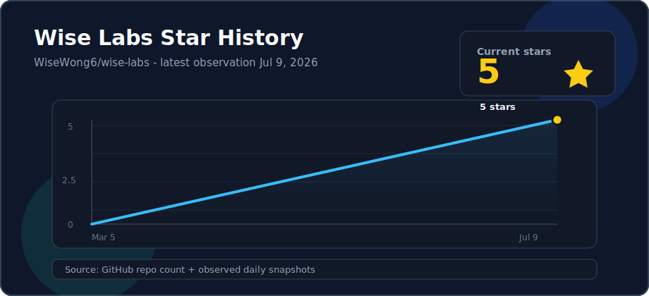

# Wise Labs 🧪

<p align="center">
  <strong>面向 AI 工作流的开发者工具集</strong>
</p>

<p align="center">
  一系列提升 AI 开发效率的实验性工具 —— 从窗口管理到组件复用
</p>

---

## 这是什么

Wise Labs 是一个面向 AI 时代开发者的工作台。它包含多个独立项目，覆盖程序化 3D 创作、终端管理和内容组件复用等场景。

每个项目都可以独立使用，组合起来则构成一套完整的 AI 开发辅助工具链。

---

## 项目地图

```
┌─────────────────────────────────────────────────────────────────────────────┐
│                                  Wise Labs                                  │
├─────────────────────────┬───────────────────────┬───────────────────────────┤
│         3D 创作          │       窗口管理         │          组件图册          │
├─────────────────────────┼───────────────────────┼───────────────────────────┤
│ forbidden-city-night    │    ai-workstation     │    html-ppt-components    │
├─────────────────────────┴───────────────────────┴───────────────────────────┤
│                    漫游故宫 → 整理窗口 → 复用 PPT 组件                       │
└─────────────────────────────────────────────────────────────────────────────┘
```

---

## 项目一览

### 🏯 [forbidden-city-night](./forbidden-city-night)

> 故宫 · 夜游 —— 程序化构建的第一人称 3D 夜游

**核心功能**
- 🏯 以程序化几何搭建宫门、宫殿、桥梁、园林与中轴空间
- 🖱️ 支持 Pointer Lock 鼠标视角与 WASD 第一人称漫游
- ✈️ 支持步行、疾走和自由飞行模式
- ✨ 本地 Three.js 模块与辉光后期处理，零构建、无外部模型或贴图
- 📱 手机端明确提示切换桌面浏览器，避免无控制方式的黑屏体验

**Tech Stack:** Three.js, WebGL, HTML, CSS, Vanilla JS

**[在线体验 →](https://wisewong.com/projects/forbidden-city-night/)** · **[查看详情 →](./forbidden-city-night)**

---

### 🖥️ [ai-workstation](./ai-workstation)

> AI Workstation / AI工位分配 —— 一键安排散乱的终端窗口

**核心功能**
- ⌨️ 快捷键一键整理 2~10 个终端窗口
- 🖥️ 支持全屏/分区两种模式
- 🔧 支持 iTerm2 / Terminal / Ghostty 混用
- 🎯 专为 Claude Code / Codex / OpenClaw 工作流设计
- ⚡ 支持 Agent 直接调用 (`/tile` 命令)

**Tech Stack:** Swift, AppleScript, Shell

**[查看详情 →](./ai-workstation)**

---

### 🧩 [html-ppt-components](./html-ppt-components)

> HTML PPT组件 —— 面向 AI 生成 PPT / 文档网页的零依赖静态组件图册

**核心功能**
- 🧭 按内容、对比、流程、结构和数据分类浏览组件
- 🖼️ 支持组件预览、详情页查看和源码视图
- 🔎 支持中英文模糊搜索、复制代码和下载 HTML 文件
- 🔗 保留 ECharts 雷达图/金字塔参考来源链接
- 🔤 内置本地思源黑体 / 思源宋体字体资源
- ⚡ 零依赖静态页面，无需构建流程

**Tech Stack:** HTML, CSS, Vanilla JS

**[查看详情 →](./html-ppt-components)**

---

### 📦 wise-labs (本仓库)

> 工具集的入口与导航 —— 你正在这里

这个仓库本身也是一个"项目"，作为整个 Wise Labs 的入口和导航中心。

---

## 快速开始

每个项目都是自包含的，可以独立克隆和运行：

```bash
# 克隆整个仓库
git clone https://github.com/WiseWong6/wise-labs.git
cd wise-labs

# 静态项目：直接用本地 HTTP 服务打开
python3 -m http.server 8080
# 打开 http://127.0.0.1:8080/forbidden-city-night/
# 打开 http://127.0.0.1:8080/html-ppt-components/

```

不同子项目的运行方式不同。静态项目可以直接用 Python HTTP server 打开。每个子目录都有自己的 README，包含详细的安装和使用说明。

---

## 设计哲学

**单一职责，组合使用**

每个工具解决一个具体问题，不追求大而全。你可以只使用其中一个，也可以组合使用形成工作流。

**AI 优先**

所有项目都考虑 AI 与程序化创作场景。forbidden-city-night 展示浏览器原生 3D 创作，ai-workstation 支持 Agent 直接调用，html-ppt-components 用于复用 AI 生成 PPT / 文档网页的组件。

**本地优先**

工具尽量在本地运行，不依赖云端服务。你的数据留在你的机器上。

---

## 社交媒体

<div align="center">
  <p>全网同名：<code>@歪斯Wise</code></p>
  <p>
    <a href="https://github.com/WiseWong6/wise-labs">GitHub Star</a> /
    <a href="https://www.xiaohongshu.com/user/profile/61f3ea4f000000001000db73">小红书</a> /
    <a href="https://x.com/killthewhys">Twitter(X)</a> /
    扫码关注公众号
  </p>
  
</div>

---

## Star History

<a href="https://www.star-history.com/#WiseWong6/wise-labs&Date">
  
</a>

[View on Star History](https://www.star-history.com/#WiseWong6/wise-labs&Date)

---

## License

MIT License - 详见 [LICENSE](./LICENSE) 文件
